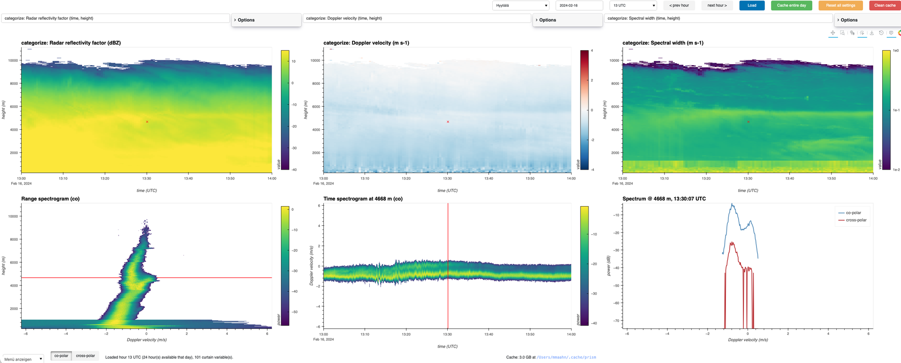

# PRISM

**P**rofiling & **R**emote-sensing **I**nteractive **S**pectra **M**onitor.

Interactive 6-panel viewer for ground-based remote-sensing time-height
products and raw Doppler spectra, currently sourced from the
[Cloudnet](https://cloudnet.fmi.fi/) data portal (RPG-FMCW-94, MIRA-10,
MIRA-35). Pick a site, date, instrument and hour; it downloads and caches the
raw spectra and processed products, then shows linked, zoomable time-height
panels plus range/time spectrograms and a single Doppler spectrum, all
connected by clicking anywhere on a moments panel.



## Install

Requires Python >= 3.10. `rpgpy` and `netCDF4` need a C compiler and the
netCDF/HDF5 libraries available at install time -- on a machine with conda
this is usually already the case; otherwise install those via your system
package manager or conda first.

With conda, install the dependencies from conda-forge first (this brings
prebuilt netCDF/HDF5 libraries, so no compiler is needed), then PRISM itself
with pip:

```bash
conda create -n prism -c conda-forge python=3.13 requests numpy xarray netcdf4 zarr holoviews panel=1.9.4 bokeh=3.8.2
conda activate prism
pip install git+https://github.com/maahn/prism.git
```

`rpgpy` isn't on conda-forge; pip installs it automatically in the last step.

Without conda, install directly from GitHub:

```bash
pip install git+https://github.com/maahn/prism.git
```

or from a local clone:

```bash
git clone https://github.com/maahn/prism.git
cd prism
pip install .
```

For development (editable install, so code edits take effect without
reinstalling):

```bash
pip install -e .
```

## Run

```bash
prism
```

This opens the viewer in your default browser. Data is downloaded from the
Cloudnet API on demand and cached locally (default `~/.cache/prism`, override
with the `PRISM_CACHE` env var). Settings (selected variables, color limits,
last site/date/instrument/hour) persist across restarts in
`~/.config/prism/settings.json` (override with `PRISM_SETTINGS`).

Options:

```bash
prism --port 8080     # fixed port instead of auto-picked
prism --no-browser    # print the URL instead of opening a tab
```

### Server mode

`prism --server` runs PRISM as a long-lived process that many people can use
at the same time, each in their own browser tab with a fully independent
session (own site/date/hour, selected variables, click point, playback):

```bash
prism --server --allow-websocket-origin prism.example.org
```

Then browse to `http://prism.example.org:5006/`.

| Option | Meaning |
| --- | --- |
| `--server` | Enable server mode (below). Listens on port 5006 unless `--port` is given, and never opens a browser. |
| `--allow-websocket-origin HOST[:PORT]` | The address users type into their browser, e.g. `prism.example.org` or `192.0.2.7:5006`. Repeatable. **Required for anyone but `localhost` to connect** -- otherwise the page loads but stays blank. `*` allows any origin (only do that behind something you trust). |
| `--address ADDR` | Interface to listen on (default `0.0.0.0`, all interfaces). Use `127.0.0.1` when a reverse proxy on the same machine fronts PRISM. |
| `--idle-timeout MINUTES` | Free a session's memory after this many minutes without activity (default `30`; `0` = never). |

What differs from the default local mode:

- **Per-session settings, not saved.** Each session starts from the built-in
  defaults (Hyytiälä, 2024-02-16, 13 UTC) and keeps its choices in memory
  only. `~/.config/prism/settings.json` is neither read nor written, so users
  can't overwrite each other's settings.
- **Shared data cache.** All sessions use one download/decode cache
  (`~/.cache/prism`, or `PRISM_CACHE`), so a file one user has loaded is
  instant for the next. Concurrent requests for the same file wait for a
  single download/decode instead of racing. Because the cache is shared, the
  **Clean cache** button is hidden (one user's click would delete data other
  users are looking at); prune the cache directory from the shell instead.
- **Idle sessions are released.** Activity means any mouse movement, click,
  key press, scroll or touch in the tab (checked in the browser, so
  zooming/panning counts). After `--idle-timeout` minutes without any, the
  session drops its loaded spectra and products, stops playback, and its page
  is replaced by a "Session ended" notice with a *Start a new session*
  button. A session whose tab is closed is released the same way shortly
  after it disconnects. Once no session is live, the shared dataset cache is
  dropped too, so an idle server returns to a small footprint.
- **Not released:** the on-disk cache. It only grows, so on a long-running
  server prune it yourself (for example a `cron` job deleting files under
  `$PRISM_CACHE` older than N days).

There is no authentication. Put PRISM behind a reverse proxy or firewall if
the server is reachable from anywhere you don't trust. Running it under
`systemd` or in a container works like any other long-running Python
process.

## Usage

1. Pick a **site**, **date** and **spectra instrument** (RPG-FMCW-94,
   MIRA-10 or MIRA-35), click **Load**. The hour dropdown fills in with only
   the hours that actually have raw Doppler spectra for that instrument.
   Not every instrument publishes raw spectra at every site -- MIRA-35, in
   particular, has only ever been observed publishing moments or PPI wind
   scans, never a vertical Doppler spectrum, across every site checked so
   far (Munich, Bucharest, Lindenberg, Melpitz).
2. Pick an hour; use the prev/next-hour buttons to step through the day.
3. Click anywhere on a moments panel (top row) to select a time/height point
   -- all other panels update to match, and axes are linked (zooming one
   time/height/velocity axis zooms every panel sharing that axis).
4. Each moments panel's dropdown lists every time-height curtain and
   time-only field Cloudnet published for that site/day, grouped by
   instrument (radar moments, target classification, lidar backscatter,
   model temperature, MWR liquid water path, etc.), not just a fixed list.
   A time-only field (like MWR's LWP) is drawn as a line plot on its own
   right-hand axis rather than forced onto the shared height axis.
5. The two spectrogram panels have a co-polar/cross-polar toggle; the single
   spectrum panel always shows both overlaid. Not every instrument publishes
   a cross-polar spectrum -- MIRA-10's archived spectra, for example, are
   co-polar only, so the cross-polar view is empty for that instrument.
6. **Clean cache** clears downloaded/decoded data (not your settings) if you
   want to free disk space or force a re-download. (Not available in server
   mode, where the cache is shared.)

## Development notes

`panel` and `bokeh` are version-pinned together in `pyproject.toml`: panel
bundles its own BokehJS build, and an installed `bokeh` newer than what that
panel version bundles makes the browser and server speak mismatched protocol
versions. Symptom: the app loads and looks fine, but clicks/taps silently do
nothing with no error anywhere. If you bump one, bump both together and
re-verify clicking works.

Several Bokeh model properties -- colorbar formatter/ticker/width, a hover
tool's tooltips, and a color mapper's linear-vs-log TYPE -- are fixed by a
`DynamicMap`'s first-ever rendered frame and are never re-applied by
HoloViews' own `.opts()` on later frames. Switching a panel's variable after
that first frame can't change any of these through the normal options API;
`app.py`'s `_make_colorbar_hook` / `_make_hover_hook` work around this by
mutating the already-attached Bokeh models directly on every frame via
HoloViews' `hooks=[...]` mechanism instead.
